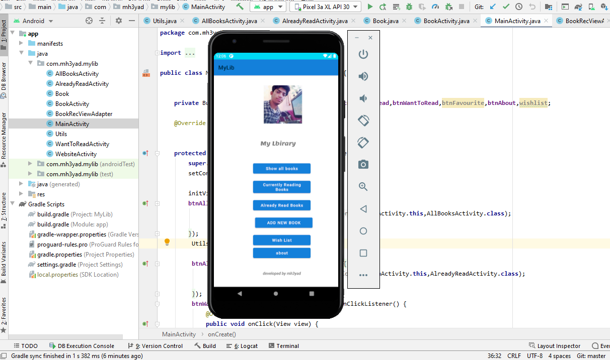
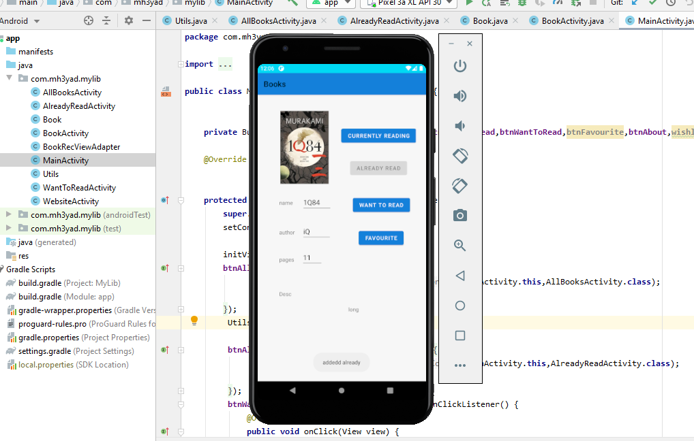
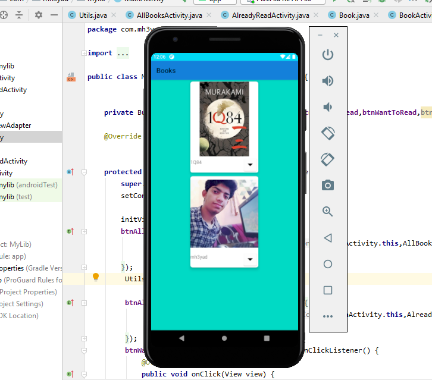

# My Library App 
### this an android app written in native java that have the following features:
  *showing all current books
  *add books to currently reading activity
  *add books to already read activity
  *delete books
  *about activity with webview features
# through my journey i have used these android methods:
  *user interfaces (RecyclerView, RelativeView, ConstraintView and CardView
  *used shared preferences to store data entered by user
  *creating activity for each feature
  *used some animation methods
  *glid dependency 
  *Gson dependency from google to store data serialized 
  *material design dependency

---

